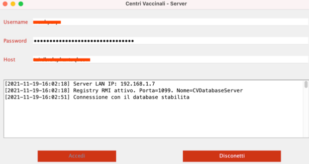
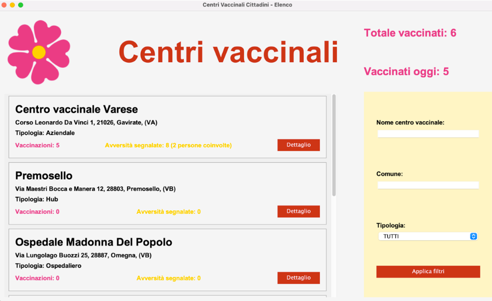
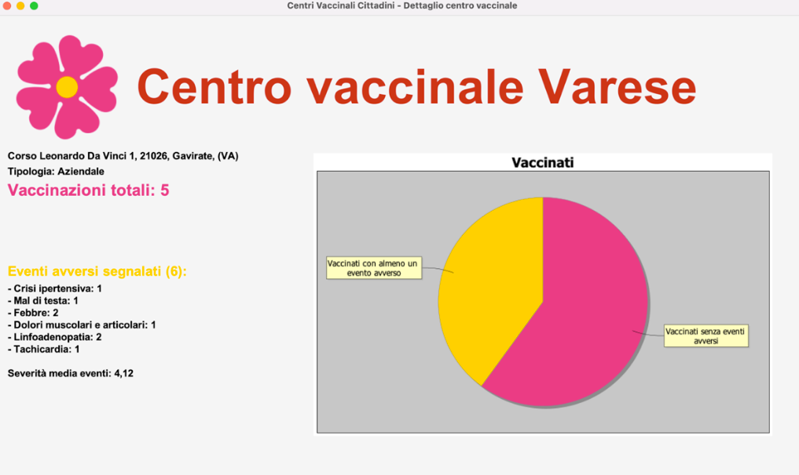
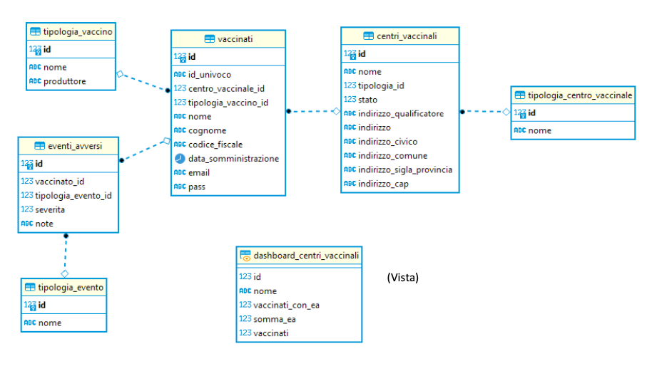

# Vaccination centers - Collection of adverse events
A boring university project, build with Java 13, to handle Covid-19 vaccination adverse event.

The goal of the Vaccination Centers project is to create a management system for vaccination centers based on 
registration of vaccination centers and users.
Following registration and vaccination, each citizen can report an adverse reaction to the vaccine using a rating scale from 1 to 5 and an additional comment of up to 256 characters.
The Vaccination centers project consists of two applications that work on the same database but with different functionalities. These are accessible only by two types of users: operators or citizens.

The database was hosted with [elephantsql](https://www.elephantsql.com/) for free.
We had an application (the server) that connect to the database with JDBC and can be used by the clients with RMI.

## Some screen
#### Server


#### Vaccination Centers user app home


#### Vaccination Centers detail


#### Database



## Build and Run with Maven
If you are using IntelliJ run these commands in the terminal by pressing CTRL + ENTER
```console
$ mvn clean:clean
$ mvn compiler:compile
$ mvn exec:java
```
